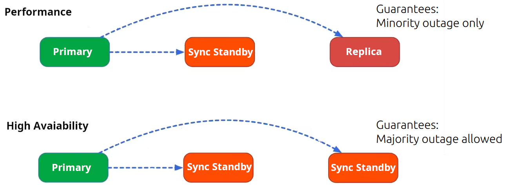

---
myst:
  html_meta:
    description: "Explanation of Charmed PostgreSQL unit types: Primary, Sync Standby, and Replica, and how they contribute to high availability and data safety."
---

(units)=
# PostgreSQL units
{{vm_k8s}}

<!--TODO: update for K8s -->

Each [high-availability](https://en.wikipedia.org/wiki/High_availability)/[disaster-recovery](https://en.wikipedia.org/wiki/IT_disaster_recovery) implementation has primary and secondary (standby) sites.

A Charmed PostgreSQL cluster size can be easily {ref}`scaled <scale-cluster>` from 0 to 10 units. {ref}`Contact us <contact>` if you have a cluster with 10+ units.

It is recommended to use 3+ units cluster size in production (due to [Raft consensus](https://en.wikipedia.org/wiki/Raft_(algorithm)) requirements). Those units type can be:
  * **Primary**: unit which accepts all writes and guarantees no [split-brain scenario](https://en.wikipedia.org/wiki/Split-brain_(computing)).
  * **Sync Standby** (synchronous copy) : designed for the fast automatic failover. Used for read-only queries and guaranties the latest transaction availability.
  * **Replica** (asynchronous copy): designed for long-running and resource consuming queries without affecting Primary performance. Used for read-only queries without guaranties of the latest transaction availability.



All SQL transactions have to be confirmed by all Sync Standby unit(s) before Primary unit commit transaction to the client. Therefore, high-performance and high-availability is a trade-off between "sync standby" and "replica" unit count in the cluster.

All Charmed PostgreSQL 14 units are configured as Sync Standby members by default. It provides better guarantees for the data survival when two of three units gone simultaneously. Users can re-configure the necessary synchronous units count using Juju config option '[synchronous-node-count](https://charmhub.io/postgresql/configurations?channel=14/stable)'.


## Primary

The [PostgreSQL primary server](https://www.postgresql.org/docs/current/runtime-config-replication.html#RUNTIME-CONFIG-REPLICATION-PRIMARY) unit may or may not be the same as the [juju leader unit](https://juju.is/docs/juju/leader).

The juju leader unit is the represented in `juju status` by an asterisk (*) next to its name:

````{tab-set}
```{tab-item} VM
:sync: vm

	Unit           Workload  Agent  Machine  Public address  Ports     Message
	postgresql/0*  active    idle   0        <address0>      5432/tcp  Primary <<<<<<<<<<<<<<
	postgresql/1   active    idle   1        <address1>      5432/tcp
	postgresql/2   active    idle   2        <address2>      5432/tcp
```
```{tab-item} K8s
:sync: k8s

	Unit               Workload  Agent  Machine  Public address  Ports     Message
	postgresql-k8s/0*  active    idle   0        <address0>      5432/tcp  Primary <<<<<<<<<<<<<<
	postgresql-k8s/1   active    idle   1        <address1>      5432/tcp
	postgresql-k8s/2   active    idle   2        <address2>      5432/tcp
```
````

However, this information can be outdated as it is being updated only on the [`update-status`](https://documentation.ubuntu.com/juju/3.6/reference/hook/#update-status) Juju event.

The most up-to-date Primary unit number can be received using Juju action `get-primary`:

````{tab-set}
```{tab-item} VM
:sync: vm

	juju run postgresql-k8s/leader get-primary
```
```{tab-item} K8s
:sync: k8s

	juju run postgresql-k8s/leader get-primary
```
````

````{dropdown} We highly recommend configuring the <code>update-status</code> hook to run frequently.
:open:
:class-container: dropdown-tip
:icon: light-bulb
:class-title: sd-font-weight-normal

In addition to reporting the primary, secondaries, and other statuses, the [status hook](https://documentation.ubuntu.com/juju/3.6/reference/hook/#update-status) performs self-healing in the case of a network cut.

To change the frequency of the `update-status` hook, run

```shell
juju model-config update-status-hook-interval=<time(s/m/h)>
```

This hook executes a read query to PostgreSQL. On a production level server, this should be configured to occur at a frequency that doesn't overload the server with read requests. Similarly, the hook should not be configured at too quick of a frequency, as this can delay other hooks from running.
````

It is also possible to retrieve this information using `patronictl` and the Patroni REST API. See {ref}`troubleshooting` for more details.

## Standby / replica

This information can be retrieved with `patronictl` and the Patroni REST API. See {ref}`troubleshooting` for more details.

Example with the machine (VM) charm:

```shell
> ... patronictl ... list
+ Cluster: postgresql (7499430436963402504) ---+-----------+----+-----------+
| Member       | Host           | Role         | State     | TL | Lag in MB |
+--------------+----------------+--------------+-----------+----+-----------+
| postgresql-0 | 10.189.210.53  | Leader       | running   |  1 |           |
| postgresql-1 | 10.189.210.166 | Sync Standby | streaming |  1 |         0 |
| postgresql-2 | 10.189.210.188 | Replica      | streaming |  1 |         0 |
+--------------+----------------+--------------+-----------+----+-----------+
```

* `postgresql-0` is a PostgreSQL Primary unit (Patroni Leader) which accepts all writes
* `postgresql-1` is a PostgreSQL/Patroni Sync Standby unit which can be promoted as new primary using manual switchover (safe).
* `postgresql-2` is a PostgreSQL/Patroni Replica unit which can NOT be directly promoted as a new Primary using manual switchover. The automatic promotion Replica=>Sync Standby is necessary to guarantee the latest SQL transactions availability on this unit to allow further promotion as a new Primary. Otherwise the manual failover can be performed to Replica unit accepting the risks of losing the last transactions(s) which lagged behind the Primary.

## Replica lag distance

At the moment, it is only possible to retrieve this information using `patronictl` and the Patroni REST API. See {ref}`troubleshooting` for more details.

Example with the machine (VM) charm:

```shell
$ ... patronictl ... list
+ Cluster: postgresql (7499430436963402504) ---+-----------+----+-----------+
| Member       | Host           | Role         | State     | TL | Lag in MB |
+--------------+----------------+--------------+-----------+----+-----------+
| postgresql-0 | 10.189.210.53  | Leader       | running   |  1 |           |
| ...
| postgresql-2 | 10.189.210.188 | Replica      | streaming |  1 |        42 |  <<<<<
+--------------+----------------+--------------+-----------+----+-----------+

$ curl ... x.x.x.x:8008/cluster | jq
  "members": [
    {
      "name": "postgresql-0",
      "role": "leader",
      "state": "running",
      ...
    },
...
    {
      "name": "postgresql-2",
      "role": "replica",
      "state": "streaming",
      ...
      "lag": 42 <<<<<<<<<<<< Lag in MB
    }
```
