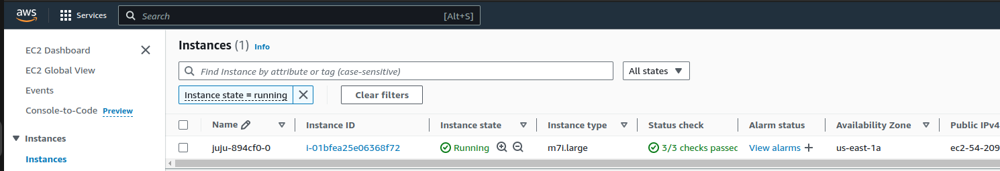

(aws-ec2)=
# How to deploy on AWS EC2
{{vm}}

[Amazon Web Services](https://aws.amazon.com/) is a popular subsidiary of Amazon that provides on-demand cloud computing platforms on a metered pay-as-you-go basis.

{octicon}`browser` AWS web console: [console.aws.amazon.com](https://console.aws.amazon.com/)

## Prerequisites
* A physical or virtual machine running Ubuntu 24.04+
* Juju 3.6+ installed via snap

---

## Install the AWS CLI

Install the Amazon Web Services CLI by following the [official AWS documentation](https://docs.aws.amazon.com/cli/latest/userguide/getting-started-install.html).

To check it is correctly installed, run

```{terminal}
:copy:

aws --version

aws-cli/2.13.25 Python/3.11.5 Linux/6.2.0-33-generic exe/x86_64.ubuntu.23 prompt/off
```

### Authenticate

[Create an IAM account](https://docs.aws.amazon.com/eks/latest/userguide/getting-started-console.html) or use legacy access keys to operate AWS EC2:

```{terminal}
:copy:

mkdir -p ~/.aws && cat <<- EOF >  ~/.aws/credentials.yaml

credentials:
  aws:
    NAME_OF_YOUR_CREDENTIAL:
      auth-type: access-key
      access-key: SECRET_ACCESS_KEY_ID
      secret-key: SECRET_ACCESS_KEY_VALUE
EOF
```

<!---TODO, teach Juju to use `aws configure` format:
```shell
~$ aws configure
AWS Access Key ID [None]: SECRET_ACCESS_KEY_ID
AWS Secret Access Key [None]: SECRET_ACCESS_KEY_VALUE
Default region name [None]: eu-west-3
Default output format [None]:
```
Check AWS credentials:
```shell
~$ aws sts get-caller-identity
{
    "UserId": "1234567890",
    "Account": "1234567890",
    "Arn": "arn:aws:iam::1234567890:root"
}
```
--->

Add AWS credentials to Juju:

```{terminal}
:copy:

juju add-credential aws -f ~/.aws/credentials.yaml
```

## Bootstrap Juju controller on AWS EC2

Bootstrap a Juju controller:

```{terminal}
:copy:

juju bootstrap aws <controller-name>

Creating Juju controller "<controller-name>" on aws/<region-name>
Looking for packaged Juju agent version 3.5.4 for amd64
Located Juju agent version 3.5.4-ubuntu-amd64 at https://juju-dist-aws.s3.amazonaws.com/agents/agent/3.5.4/juju-3.5.4-linux-amd64.tgz
Launching controller instance(s) on aws/<region-name>...
 - i-0f4615983d113166d (arch=amd64 mem=8G cores=2)
Installing Juju agent on bootstrap instance
Waiting for address
Attempting to connect to 54.226.221.6:22
Attempting to connect to 172.31.20.34:22
Connected to 54.226.221.6
Running machine configuration script...
Bootstrap agent now started
Contacting Juju controller at 54.226.221.6 to verify accessibility...

Bootstrap complete, controller "<controller-name>" is now available
Controller machines are in the "controller" model

Now you can run
	juju add-model <model-name>
to create a new model to deploy workloads.
```

{{seealso}} [Juju | Amazon EC2 bootstrap options](https://juju.is/docs/juju/amazon-ec2)

```{dropdown} You can check the instance availability in the web interface
:icon: browser
:color: light
:class-title: sd-font-weight-normal



(Make sure to choose the right region!)
```

## Access a test database (optional)

```{include} ../reuse/access-test-database.md
```

## Expose database (optional)

```{include} ../reuse/expose-database.md
```

## Clean up

```{include} ../reuse/clean-cloud-resources.md
```

Next, check and manually delete all unnecessary AWS EC2 instances and resources.

To show the list of all your EC2 instances run the following command:

```{terminal}
:copy:

aws ec2 describe-instances --region us-east-1 --query "Reservations[].Instances[*].{InstanceType: InstanceType, InstanceId: InstanceId, State: State.Name}" --output table

-------------------------------------------------------
|                  DescribeInstances                  |
+---------------------+----------------+--------------+
|     InstanceId      | InstanceType   |    State     |
+---------------------+----------------+--------------+
|  i-0f374435695ffc54c|  m7i.large     |  terminated  |
|  i-0e1e8279f6b2a08e0|  m7i.large     |  terminated  |
|  i-061e0d10d36c8cffe|  m7i.large     |  terminated  |
|  i-0f4615983d113166d|  m7i.large     |  terminated  |
+---------------------+----------------+--------------+
```

List your Juju credentials:

```{terminal}
:copy:

juju credentials

...
Client Credentials:
Cloud        Credentials
aws          <credential-name>
...
```

Remove AWS EC2 CLI credentials from Juju:

```{terminal}
:copy:

juju remove-credential aws <credential-name>
```

Finally, remove AWS CLI user credentials (to avoid forgetting and leaking):

```{terminal}
:copy:

rm -f ~/.aws/credentials.yaml
```
