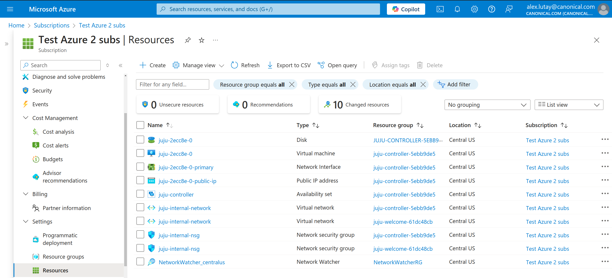

---
myst:
  html_meta:
    description: "Deploy Charmed PostgreSQL on Microsoft Azure using Juju, with instructions for Azure CLI installation and subscription authentication."
---

(azure)=
# How to deploy on Azure
{{vm}}

[Azure](https://azure.com/) is a cloud computing platform developed by Microsoft. It has management, access and development of applications and services to individuals, companies, and governments through its global infrastructure.

{octicon}`browser` Azure web console: [portal.azure.com](https://portal.azure.com/)

## Prerequisites

* A physical or virtual machine running Ubuntu 22.04+
* Juju 3.6+ installed via snap
* The `Azure interactive` method (with web browser authentication `service-principal-secret-via-browser`) requires an Azure subscription.
  * See: [Azure | Create a subscription](https://learn.microsoft.com/en-us/azure/cost-management-billing/manage/create-subscription) - you will need the Azure subscription ID for Juju.

---

## Install the Azure CLI

Install the Azure CLI for Linux by following the [official Azure documentation](https://learn.microsoft.com/en-us/cli/azure/install-azure-cli-linux?pivots=apt).

To check it is correctly installed, run

```{terminal}
:copy:

az --version

azure-cli                         2.65.0
core                              2.65.0
telemetry                          1.1.0

Dependencies:
msal                              1.31.0
azure-mgmt-resource               23.1.1
...

Your CLI is up-to-date.
```

## Authenticate

```{dropdown} Choose the authentication method that fits you best.
:class-container: dropdown-note
:icon: info
:class-title: sd-font-weight-normal

Follow the [official Juju Azure documentation](https://juju.is/docs/juju/microsoft-azure) to get an overview of the different methods.

See also this [official post](https://discourse.charmhub.io/t/how-to-use-juju-with-microsoft-azure/15219) for further information and discussions.
```

In this guide, we use the currently recommended `interactive` method with web browser authentication `service-principal-secret-via-browser`. This method does not require logging in with the Azure CLI locally, but it **requires an [Azure subscription](https://learn.microsoft.com/en-us/azure/cost-management-billing/manage/create-subscription)**.

Once you have an Azure subscription ID, add Azure credentials to Juju:

```{terminal}
:copy:

juju add-credential azure
```

This will start a script that will help you set up the credentials, where you will be asked to fill in a set of parameters:

* `credential-name`: A sensible name that will help you identify the credential set. Store it as `<CREDENTIAL_NAME>`.
* `region`: Any default region that is more convenient for you to deploy your controller and applications. Note that credentials are not region-specific.
* `auth type`: Select `interactive`, which is the recommended way to authenticate to Azure using Juju
* `subscription_id`: Use the value `<subscription_id>` from the Azure subscription created in the previous step.
* `application_name`: Generate a random string to avoid collision with other users or applications
* `role-definition-name`: Generate a random string to avoid collision with other users or applications, and store it as `<AZURE_ROLE>`.

After prompting this information, you will be asked to authenticate the requests via web browser with a message that provides a code:

```text
To sign in, use a web browser to open the page https://microsoft.com/devicelogin and enter the code <YOUR_CODE> to authenticate.
```

In the browser, open the [authentication page](https://microsoft.com/devicelogin) and enter the code `<YOUR_CODE>` provided in the output.

You will be asked to authenticate twice, for allowing the creation of two different resources in Azure.

If successful, you will see a confirmation that the credentials have been correctly added locally:

```text
Credential <CREDENTIAL_NAME> added locally for cloud "azure".
```

````{dropdown} *Example*
:icon: terminal
:color: light
:class-title: sd-font-weight-normal

```{terminal}
:copy:

juju add-credential azure

This operation can be applied to both a copy on this client and to the one on a controller.
No current controller was detected and there are no registered controllers on this client: either bootstrap one or register one.
Enter credential name: azure-test-credentials1

Regions
  centralus
  eastus
  ...

Select region [any region, credential is not region specific]: eastus

Auth Types
  interactive
  service-principal-secret
  managed-identity

Select auth type [interactive]: interactive

Enter subscription-id: [USE-YOUR-REAL-AZURE-SUBSCRIPTION-ID]

Enter application-name (optional): azure-test-name1

Enter role-definition-name (optional): azure-test-role1

Note: your user account needs to have a role assignment to the
Azure Key Vault application (....).
You can do this from the Azure portal or using the az cli:
  az ad sp create --id ...

Initiating interactive authentication.

To sign in, use a web browser to open the page https://microsoft.com/devicelogin and enter the code HIDDEN to authenticate.
To sign in, use a web browser to open the page https://microsoft.com/devicelogin and enter the code HIDDEN to authenticate.
Credential "azure-test-credentials1" added locally for cloud "azure".
```
````

## Bootstrap Juju controller on Azure

Bootstrap a Juju controller:

```{terminal}
:copy:

juju bootstrap azure <controller-name>

Creating Juju controller "<controller-name>" on <cloud-name>/<region-name>
Looking for packaged Juju agent version 3.6-rc1 for amd64
No packaged binary found, preparing local Juju agent binary
Launching controller instance(s) on <cloud-name>/<region-name>...
 - juju-aeb5ea-0 (arch=amd64 mem=3.5G cores=1)
Installing Juju agent on bootstrap instance
Waiting for address
Attempting to connect to 192.168.16.4:22
Attempting to connect to 172.170.35.99:22
Connected to 172.170.35.99
Running machine configuration script...
Bootstrap agent now started
Contacting Juju controller at 192.168.16.4 to verify accessibility...

Bootstrap complete, controller "<controller-name>" is now available
Controller machines are in the "controller" model

Now you can run
	juju add-model <model-name>
to create a new model to deploy workloads.
```

{{seealso}} [Juju | Microsoft Azure options](https://documentation.ubuntu.com/juju/3.6/reference/cloud/list-of-supported-clouds/the-microsoft-azure-cloud-and-juju/)

```{dropdown} You can check the instance availability in the web interface
:icon: browser
:color: light
:class-title: sd-font-weight-normal



```

## Access a test database (optional)

```{include} ../reuse/access-test-database.md
```

## Expose database (optional)

```{include} ../reuse/expose-database.md
```

## Clean up

```{include} ../reuse/clean-cloud-resources.md
```

Next, check and manually delete all unnecessary Azure VM instances and resources.

Make sure there are no running resources left, and run the following command to show the list of all your Azure VMs:

```{terminal}
:copy:

az vm list

(...)
```
```{terminal}
:copy:

az resource list

(...)
```

List your Juju credentials:

```{terminal}
:copy:

juju credentials

...
Client Credentials:
Cloud        Credentials
azure        <credential-name>
...
```

Remove Azure CLI credentials from Juju:

```{terminal}
:copy:

juju remove-credential azure <credential-name>
```

After deleting the credentials, the `interactive` process may still leave the role resource and its assignment hanging around.

We recommend you to check if these are still present with:

```{terminal}
:copy:

az role definition list --name <credential-name>
```

You can also check whether you still have a role assignment bound to `<credential-name>` registered using:

```{terminal}
:copy:

az role assignment list --role <credential-name>
```

If this is the case, you can remove the role assignment first and then the role itself with the following commands:

```{terminal}
:copy:

az role assignment delete --role <credential-name>
```
```{terminal}
:copy:

az role definition delete --name <credential-name>
```

Finally, log out of the Azure CLI user credentials to prevent any credential leakage:

```{terminal}
:copy:

az logout
```
