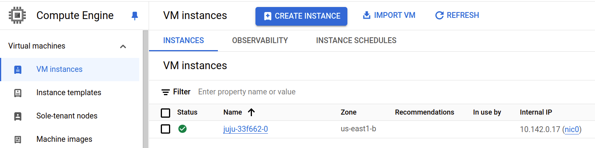

---
myst:
  html_meta:
    description: "Deploy Charmed PostgreSQL on Google Compute Engine (GCE) using Juju, with step-by-step instructions for Google Cloud CLI setup and authentication."
---

(gce)=
# How to deploy on GCE
{{vm}}

[Google Compute Engine](https://cloud.google.com/products/compute) is a popular subsidiary of Google that provides on-demand cloud computing platforms on a metered pay-as-you-go basis.

{octicon}`browser` Google Cloud web console: [console.cloud.google.com](https://console.cloud.google.com/compute/instances)

## Prerequisites

* A physical or virtual machine running Ubuntu 22.04+
* Juju 3.6+ installed via snap

---

## Install the Google Cloud CLI

Install the Google Cloud CLI:

```{terminal}
:copy:

sudo snap install google-cloud-cli --classic
```

Check the official the [official Google Cloud documentation](https://cloud.google.com/sdk/docs/install) for other installation options.

To check it is correctly installed, run

```{terminal}
:copy:

gcloud --version

Google Cloud SDK 474.0.0
...
```

### Authenticate

Log in to Google Cloud:

```{terminal}
:copy:

gcloud auth login
```

[Create an service IAM account](https://cloud.google.com/iam/docs/service-accounts-create) for Juju to operate GCE:

```{terminal}
:copy:

gcloud iam service-accounts create juju-gce-account --display-name="Juju GCE service account"

Created service account [juju-gce-account].
```

Check your list of accounts:

```{terminal}
:copy:
gcloud iam service-accounts list

DISPLAY NAME                   EMAIL                                                               DISABLED
...
Juju GCE service account       juju-gce-account@canonical-data-123456.iam.gserviceaccount.com      False
...
```

Create a private key:

```{terminal}
:copy:

gcloud iam service-accounts keys create sa-private-key.json  --iam-account=juju-gce-account@canonical-data-123456.iam.gserviceaccount.com

created key [aaaaaaa....aaaaaaa] of type [json] as [sa-private-key.json] for [juju-gce-account@canonical-data-123456.iam.gserviceaccount.com]
```

Add a [policy binding](https://docs.cloud.google.com/sdk/gcloud/reference/projects/add-iam-policy-binding) to the IAM policy of the project:

```{terminal}
:copy:
:scroll:

gcloud projects add-iam-policy-binding canonical-data-123456 --role=roles/compute.admin --member serviceAccount:juju-gce-account@canonical-data-123456.iam.gserviceaccount.com
```

## Bootstrap Juju controller on GCE

Due to a [known Juju issue](https://bugs.launchpad.net/juju/+bug/2007575), move the newly exported Google Cloud JSON file into a snap-accessible folder:

```{terminal}
:copy:

sudo mv sa-private-key.json /var/snap/juju/common/sa-private-key.json
```
```{terminal}
:copy:
sudo chmod a+r /var/snap/juju/common/sa-private-key.json
```

Add GCE credentials to Juju:

```{terminal}
:copy:

juju add-credential google

...
Enter credential name: juju-gce-account
...

Auth Types
  jsonfile
  oauth2

Select auth type [jsonfile]: jsonfile

Enter path to the .json file containing a service account key for your project
Path: /var/snap/juju/common/sa-private-key.json

Credential "juju-gce-account" added locally for cloud "google".
```

Bootstrap a Juju controller:

```{terminal}
:copy:

juju bootstrap google gce

Creating Juju controller "gce" on google/us-east1
Looking for packaged Juju agent version 3.5.4 for amd64
Located Juju agent version 3.5.4-ubuntu-amd64 at https://streams.canonical.com/juju/tools/agent/3.5.4/juju-3.5.4-linux-amd64.tgz
Launching controller instance(s) on google/us-east1...
 - juju-33f662-0 (arch=amd64 mem=3.6G cores=4)
Installing Juju agent on bootstrap instance
Waiting for address
Attempting to connect to 35.231.246.157:22
Attempting to connect to 10.142.0.17:22
Connected to 35.231.246.157
Running machine configuration script...
Bootstrap agent now started
Contacting Juju controller at 35.231.246.157 to verify accessibility...

Bootstrap complete, controller "gce" is now available
Controller machines are in the "controller" model

Now you can run
	juju add-model <model-name>
to create a new model to deploy workloads.
```

{{seealso}} [Juju | Google Cloud bootstrap options](https://juju.is/docs/juju/google-gce)

```{dropdown} You can check the instance availability in the web interface
:icon: browser
:color: light
:class-title: sd-font-weight-normal

Web interface: https://console.cloud.google.com/compute/instances



(Make sure to choose the right Google Cloud project!)
```

## Access a test database (optional)

```{include} ../reuse/access-test-database.md
```

## Expose database (optional)

```{include} ../reuse/expose-database.md
```

## Clean up

```{include} ../reuse/clean-cloud-resources.md
```

Next, check and manually delete all unnecessary Google Cloud resources.

Run the following command to show the list of all your GCE instances:

```{terminal}
:copy:

gcloud compute instances list

NAME           ZONE        MACHINE_TYPE   PREEMPTIBLE  INTERNAL_IP  EXTERNAL_IP     STATUS
juju-33f662-0  us-east1-b  n1-highcpu-4                10.142.0.17  35.231.246.157  RUNNING
juju-e2b96f-0  us-east1-b  n2d-highcpu-2               10.142.0.18  35.237.64.81    STOPPING
juju-e2b96f-1  us-east1-d  n2d-highcpu-2               10.142.0.19  34.73.238.173   STOPPING
```


List your Juju credentials:

```{terminal}
:copy:

juju credentials

...
Client Credentials:
Cloud        Credentials
google       juju-gce-account
...
```

Remove Google Cloud credentials from Juju:

```{terminal}
:copy:

juju remove-credential google juju-gce-account
```

Finally, remove Google Cloud JSON file user credentials to prevent any credential leakage:

```{terminal}
:copy:

rm -f /var/snap/juju/common/sa-private-key.json
```
