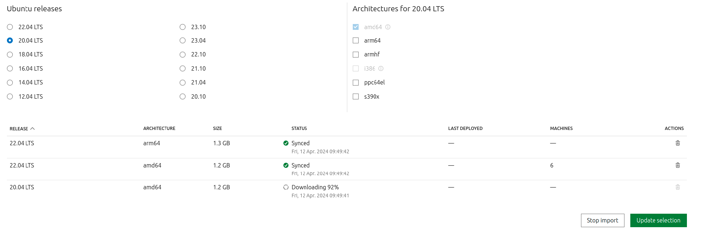
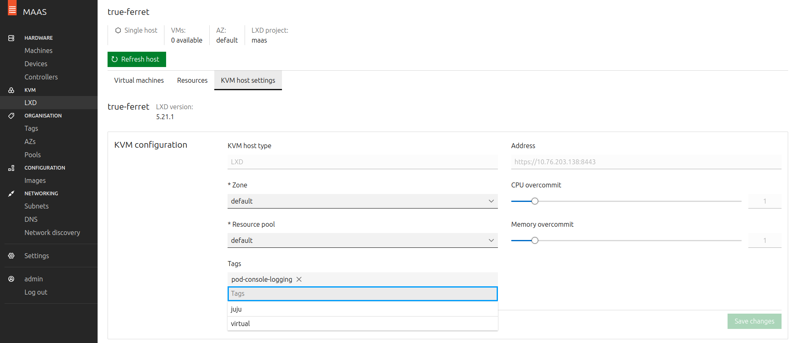
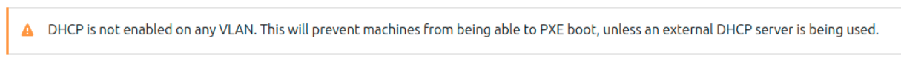

---
myst:
  html_meta:
    description: "Deploy Charmed PostgreSQL on MAAS (Metal as a Service) using Juju, with setup for the MAAS environment, images, and LXD configuration."
---

(maas)=
# How to deploy on MAAS
{{vm}}

This guide aims to provide a quick start to deploying Charmed PostgreSQL on MAAS.

## Prerequisites

* A physical or virtual machine running Ubuntu 24.04+
* Juju 3.6+ installed via snap

---

## Set up your environment

To try things out in a simple test environment with Multipass, see:
* [MAAS documentation | Build a MAAS and LXD environment in 30 minutes](https://canonical.com/maas/docs/latest/tutorial/)

To set up a local installation on a single machine, follow:
* [MAAS documentation | Install MAAS](https://canonical.com/maas/docs/latest/how-to-guides/get-started/install-maas/)

## Configure MAAS

Open the URL `http://<MAAS_IP>:5240/MAAS/` in your web browser, and log in with the default credentials:
* username=`admin`
* password=`admin`.

Complete the additional MAAS configuration in the welcome screen.

Wait for image downloads to complete on `http://<MAAS_IP>:5240/MAAS/r/images`

```{dropdown} <code>/MAAS/r/images</code>
:open:
:icon: browser
:color: light
:class-title: sd-font-weight-normal


```

Make sure you are downloading **24.04** images as well.

The LXD machine will be up and running after the images downloading and sync is completed.

Navigate to `http://<MASS_IP>:5240/MAAS/r/tags` and create a tag with `tag-name=juju`. Assign it to the LXD machine.

```{dropdown} <code>/MAAS/r/tags</code>
:open:
:icon: browser
:color: light
:class-title: sd-font-weight-normal


```

If you are on Multipass, dump the MAAS admin user API key to add as Juju credentials later:

```{terminal}
:copy:

multipass exec maas -- sudo maas apikey --username admin
```

</br>

```{dropdown} Make sure to enable DHCP service inside the MAAS VM only.
:class-container: dropdown-caution
:icon: alert-fill
:class-title: sd-font-weight-normal

MAAS uses DHCP to boot and install new machines. You must enable DHCP manually if you see this banner on MAAS pages:


Use the internal VM network `fabric-1` on `10.10.10.0/24` and choose a range (e.g. `10.10.10.100-10.10.10.120`). Check the [official MAAS manual](https://maas.io/docs/enabling-dhcp) for more information about enabling DHCP.
```

## Register MAAS with Juju

Add MAAS cloud and credentials to Juju.

These commands are interactive, so the following code block shows a sample output. **Make sure to enter your own information when prompted by Juju.**

```{terminal}
:copy:

juju add-cloud

> Since Juju 2 is being run for the first time, downloading latest cloud information. Fetching latest public cloud list... Your list of public clouds is up to date, see `juju clouds`. Cloud Types
>    maas
>    manual
>    openstack
>    oracle
>    vsphere
>
> Select cloud type: maas
> Enter a name for your maas cloud: maas-cloud
> Enter the API endpoint url: http://<MAAS_IP>:5240/MAAS
> Cloud "maas-cloud"
```

```{terminal}
:copy:

juju add-credential maas-cloud

> ...
> Enter credential name: maas-credentials
>
> Regions
>   default
> Select region [any region, credential is not region specific]: default
> ...
> Using auth-type "oauth1".
> Enter maas-oauth: $(paste the MAAS Keys copied from the output above or from http://YOUR_MAAS_IP:5240/MAAS/r/account/prefs/api-keys )
> Credential "maas-credentials" added locally for cloud "maas-cloud".
```

Bootstrap a Juju controller. Add the flags `--credential` if you registered several MAAS credentials, and `--debug` if you want to see bootstrap details:

```{terminal}
:copy:

juju bootstrap --constraints tags=juju maas-cloud maas-controller
```

## Deploy Charmed PostgreSQL on MAAS

Create a Juju model:

```{terminal}
:copy:

juju add-model <model-name> maas-cloud
```

Deploy PostgreSQL:

```{terminal}
:copy:

juju deploy postgresql --channel 16/stable
```

```{terminal}
:copy:

juju status --watch 1s

Model         Controller       Cloud/Region        Version  SLA          Timestamp
<model-name>  maas-controller  maas-cloud/default  3.1.8    unsupported  12:50:26+02:00

App         Version  Status  Scale  Charm       Channel    Rev  Exposed  Message
postgresql  16.9     active      1  postgresql  16/stable  843  no       Primary

Unit           Workload  Agent  Machine  Public address  Ports     Message
postgresql/0*  active    idle   0        10.10.10.5      5432/tcp  Primary

Machine  State    Address     Inst id        Base          AZ       Message
0        started  10.10.10.5  wanted-dassie  ubuntu@22.04  default  Deployed
```


## Clean up the environment

Always clean cloud resources that are no longer necessary; they could be costly!

### Multipass

If you are using Multipass, you can **delete all your data** by removing the VM entirely. See the documentation for [`multipass delete`](https://multipass.run/docs/delete-command).

### Local deployment

```{include} ../reuse/clean-cloud-resources.md
:start-after: "costly!\n"
```