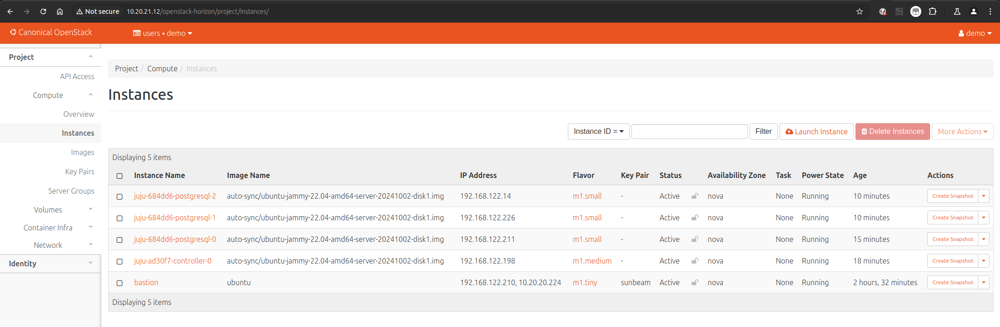

(sunbeam)=
# How to deploy on Sunbeam
{{vm}}

```{dropdown} Approximate duration: up to 60min
:color: secondary
:icon: clock
:class-title: sd-font-weight-normal

May vary depending on internet download speed.
```

This guide goes through the steps for setting up Sunbeam and deploying Charmed PostgreSQL.

## Prerequisites

* A physical or virtual machine running Ubuntu 24.04+
* Hardware requirements depend on planned deployment size.
  * Recommended: 8 CPU cores, 32GB RAM, 100GB of storage
  * Minimum: See the requirements listed in the [Sunbeam documentation](https://canonical-openstack.readthedocs-hosted.com/en/latest/how-to/install/install-canonical-openstack-using-the-manual-bare-metal-provider/)

---

## Install and bootstrap Sunbeam

Follow the [official OpenStack installation guide](https://canonical-openstack.readthedocs-hosted.com/en/latest/how-to/install/install-canonical-openstack-using-the-manual-bare-metal-provider/).

Pay attention to the `Caution` and `Note` sections - the `/etc/hosts` will require a [manual {spellexception}`fqdn` fix](https://github.com/canonical/multipass/issues/3277#issuecomment-2471434029).

## Enable OpenStack images auto-sync

Follow the official [Images Sync](https://canonical-openstack.readthedocs-hosted.com/en/latest/how-to/features/images-sync/) guide to enable auto-sync and wait for the image `24.04` to be downloaded.

## Set up Juju inside an OpenStack bastion

Follow the OpenStack guide [Manage workloads with Juju](https://canonical-openstack.readthedocs-hosted.com/en/latest/how-to/misc/manage-workloads-with-juju/) from the beginning, and stop after the section "Create a Juju controller".

To summarise, the relevant sections are:
* "Set up the bastion"
* "Install and configure the Juju client"
* "Create a Juju controller"

## Deploy Charmed PostgreSQL

Add a model if you don't have one already, and deploy a PostgreSQL cluster. Use the `-n` flag to specify number of units.

```{terminal}
:copy:

juju add-model <model-name>
```
```{terminal}
:copy:

juju deploy postgresql --channel 16/stable --base ubuntu@24.04 -n 3
```

```{terminal}
:copy:

juju status --watch 1s

Model         Controller     Cloud/Region       Version  SLA          Timestamp
<model-name>  my-controller  sunbeam/RegionOne  3.6.1    unsupported  19:42:44Z

App         Version  Status  Scale  Charm       Channel    Rev  Exposed  Message
postgresql  16.9     active      3  postgresql  16/stable  843  no

Unit           Workload  Agent  Machine  Public address   Ports     Message
postgresql/0*  active    idle   0        192.168.122.211  5432/tcp  Primary
postgresql/1   active    idle   1        192.168.122.226  5432/tcp
postgresql/2   active    idle   2        192.168.122.14   5432/tcp

Machine  State    Address          Inst id                               Base          AZ    Message
0        started  192.168.122.211  3f0a331c-bc08-4bae-af22-44087a7b74d6  ubuntu@24.04  nova  ACTIVE
1        started  192.168.122.226  e6e908f8-0da1-4440-9bbd-9f1c1bc780df  ubuntu@24.04  nova  ACTIVE
2        started  192.168.122.14   6f9ad7cd-2a9d-435e-a6d8-3e39bf2218cd  ubuntu@24.04  nova  ACTIVE
```

## Access the OpenStack dashboard (optional)

Follow the official guide: [Accessing the OpenStack dashboard](https://canonical-openstack.readthedocs-hosted.com/en/latest/how-to/misc/using-the-openstack-dashboard/).

````{dropdown} When using a Multipass VM, you may need to manually route OpenStack IPs.
:open:
:color: info
:icon: info
:class-title: sd-font-weight-normal

For example:

```shell
sudo ip route add 10.10.10.0/24 via 10.76.203.210
```

where `10.76.203.210` is the IP of the Multipass VM and  `10.10.10.0` is the network returned by `sunbeam dashboard-url`.
````

The image below is an example of the OpenStack dashboard view (bastion + juju controller + 3 `postgresql` nodes):



