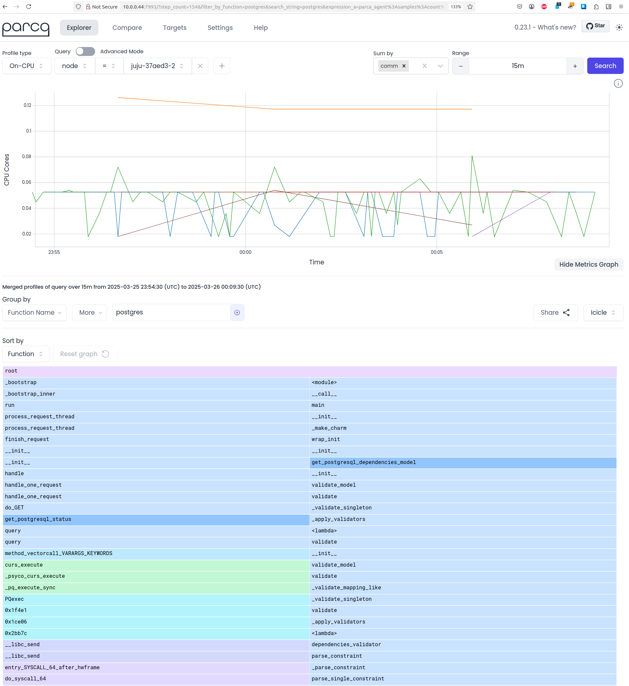
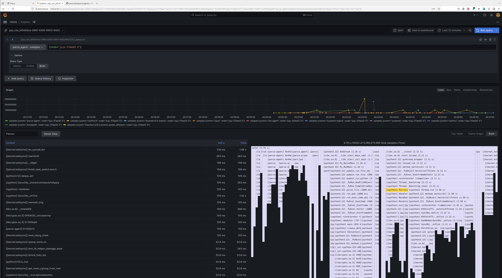

# Enable profiling with Parca
{{vm}}

This guide contains the steps to enable profiling with [Parca](https://www.parca.dev/docs/overview/) for your PostgreSQL application.

```{important}
Read the {ref}`prerequisites` section carefully if you are deploying PostgreSQL in an **LXD model** or if your **base is `ubuntu@22.04`**.
```

## Prerequisites

* A PostgreSQL deployment on a VM/machine cloud (K8s is not supported)
* **If you are using an LXD model**, LXD's virtualisation type must be set to `virtual-machine`.
  * See: {ref}`lxd-virtualisation-type`
* **If your base is `ubuntu@22.4`**, you must use the `generic` flavour of Linux.
  * See: {ref}`base-ubuntu-version`

(lxd-virtualisation-type)=
### LXD virtualisation type

If you are deploying Charmed PostgreSQL in a LXD model, ensure that LXD's virtualisation type is set to `virtual-machine` for the Juju application.

This is because LXD does not allow `/sys/kernel/tracing` to be mounted in a system container (even in privileged mode) due to security isolation concerns.

To ensure that a virtual machine is used instead of a system container, you would need to add constraints, for example:

```shell
juju deploy postgresql --channel 16/stable --constraints="virt-type=virtual-machine"`
```

(base-ubuntu-version)=
### Base (Ubuntu version)
If your base is `ubuntu@22.04`, ensure that your are using the `generic` flavour of Linux.

You can confirm this with

```shell
uname -r
```

If you do not have the `generic` flavour, you can enable it on a unit to be profiled as follows:

```shell
juju ssh postgresql/0 bash
sudo apt-get update && sudo apt-get install linux-image-virtual
sudo apt-get autopurge linux-image-kvm
```

If your application is deployed in an LXD model, run the following command:

```shell
rm /etc/default/grub.d/40-force-partuuid.cfg
```

Open the `/etc/default/grub` file  with your editor of choice and replace the line that starts with `GRUB_DEFAULT=` with:

```shell
release=$(linux-version list | grep -e '-generic$' | sort -V | tail -n1)
GRUB_DEFAULT="Advanced options for Ubuntu>Ubuntu, with Linux $release"
```

Exit out of the `/etc/default/grub file`, update GRUB, and reboot:

```shell
sudo update-grub
sudo reboot
```

Nothing needs to be done if the base is `ubuntu@24.04`, which already loads the kernel symbol table for debugging by default.

## Set up the Parca backend

There are two potential backends:
* {ref}`Charmed Parca K8s <charmed-parca-k8s>` (requires COS and cross-model integrations)
* {ref}`Polar Signals Cloud <polar-signals-cloud>` (COS is optional)

(charmed-parca-k8s)=
### Charmed Parca K8s

This section goes through the steps for enabling profiling with Charmed Parca K8s as the backend.

(deploy-cos-lite-and-parca-k8s)=
#### 1. Deploy `cos-lite` and `parca-k8s`

Refer to [Getting started on MicroK8s](https://charmhub.io/topics/canonical-observability-stack/tutorials/install-microk8s) and deploy the `cos-lite` bundle from the `latest/edge` track in a Kubernetes environment.

Then, refer to [Deploy Charmed Parca on top of COS-lite](https://discourse.charmhub.io/t/how-to-deploy-charmed-parca-on-top-of-cos-lite/16579) to deploy Charmed Parca K8s in the same model as the `cos-lite` bundle.

(parca-offer-interfaces)=
#### 2. Offer interfaces

Offer interfaces for cross-model integrations:

```shell
juju offer <parca_k8s_application_name>:parca-store-endpoint
```

#### 3. Deploy and integrate `parca-agent` with `postgresql`

Switch to the model containing the Charmed PostgreSQL deployment, deploy Charmed Parca Agent, and integrate it with Charmed PostgreSQL:

```shell
juju switch <machine_controller_name>:<postgresql_model_name>

juju deploy parca-agent --channel latest/edge
juju integrate postgresql parca-agent
```

#### 4. Integrate `parca-agent` with `parca-k8s`

Consume the Parca offer from [Step 2](#parca-offer-interfaces) and integrate with them:

```shell
juju find-offers <k8s_controller_name>:
```

```{tip}
Do not miss the colon "`:" in the command above.
```

Below is a sample output where `k8s` is the K8s controller name and `cos` is the model where `cos-lite` and `parca-k8s` are deployed:

```shell
Store  URL                            Access  Interfaces
k8s    admin/cos.parca                admin   parca_store:parca-store-endpoint
```

Next, consume this offer so that is reachable from the current machine model:

```shell
juju consume k8s:admin/cos.parca
```

Finally, relate Charmed Parca Agent with the consumed offer endpoint:

```shell
juju integrate parca-agent parca
```

(polar-signals-cloud)=
### Polar Signals Cloud

This section goes through the steps for enabling profiling with Polar Signals Cloud (PSC) as the backend.

```{note}
With PSC, `cos-lite` and `parca-k8s` are not required.

This section goes through the recommended setup, where `polar-signals-cloud-integrator` is deployed in the same model as `postgresql`, and `parca-agent` is used to relay traffic to PSC.

If you would like to use `parca-k8s` to relay traffic to PSC instead, refer to [Steps 1 and 2](#deploy-cos-lite-and-parca-k8s) in the Charmed Parca K8s section.
```

#### 1. Deploy and integrate `parca-agent` with `postgresql`

In the machine model where PostgreSQL is deployed, deploy `parca-agent` and integrate it with `postgresql`:

```shell
juju deploy parca-agent --channel latest/edge
juju integrate postgresql parca-agent
```

#### 2. Integrate `parca-agent` with `polar-signals-cloud-integrator`

Follow the guide [How to integrate with Polar Signals Cloud](https://discourse.charmhub.io/t/charmed-parca-docs-how-to-integrate-with-polar-signals-cloud/16559).

## View profiles

After the backend setup is complete, the profiles for the machines where the PostgreSQL units are running will be accessible from the Parca web interface.

If you are running Charmed Parca K8s, you can also access the link for Parca's web interface from COS catalogue (`juju run traefik/0 show-proxied-endpoints` in the K8s model where `cos-lite` is deployed).



Furthermore, if you have `cos-lite` deployed, you can use Grafana to explore profiles under the `Explore` section with `parca-k8s` as the data source.



