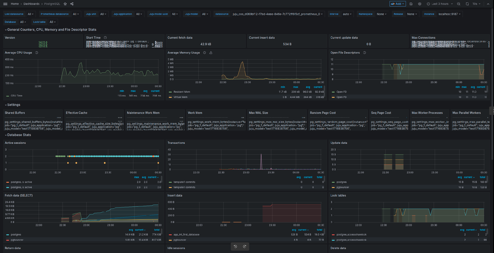

---
myst:
  html_meta:
    description: "Connect Charmed PostgreSQL with COS Lite (Grafana, Prometheus, Loki) for observability via cross-model offers and Juju integrations."
---

(enable-monitoring)=
# How to enable monitoring
{{vm}} {{k8s}}

To enable monitoring and observability, {term}`COS <Canonical Observability Stack>` should be deployed in a separate Juju controller and model from PostgreSQL.

In this guide, we'll refer to the following:
* `<cos_k8s_controller>` is a Kubernetes Juju controller
   * `<cos_model>` is the Juju model where the COS lite bundle is deployed
* `<postgresql_controller>` is a VM **or** Kubernetes Juju controller, depending on which substrate you have PostgreSQL deployed on
  * `<postgresql_model>` is the Juju model where PostgreSQL is deployed

## Prerequisites

* The `cos-lite` bundle deployed in a Kubernetes environment
  * See: [COS Microk8s tutorial](https://charmhub.io/topics/canonical-observability-stack/tutorials/install-microk8s)

---

## Offer interfaces via the COS controller

First, we will switch to the COS K8s environment and offer COS interfaces to be cross-model integrated with the model hosting Charmed PostgreSQL.

To switch to the Kubernetes controller for the COS model, run

```shell
juju switch <cos_k8s_controller>:<cos_model>
```

To offer the COS interfaces, run

```shell
juju offer grafana:grafana-dashboard
juju offer loki:logging
juju offer prometheus:receive-remote-write
```

## Consume offers via the PostgreSQL model

Next, we will switch to the Charmed PostgreSQL model, find offers, and consume them.

We are currently on the Kubernetes controller for the COS model. To switch to the PostgreSQL model, run

```shell
juju switch <postgresql_controller>:<postgresql_model>
```

To find offers, run the following command (make sure not to miss the ":" at the end!):

```shell
juju find-offers <cos_k8s_controller>:
```

The output should be similar to the sample below:

```shell
Store                 URL                            Access  Interfaces
<cos_k8s_controller>  admin/<cos_model>:grafana      admin   grafana:grafana-dashboard
<cos_k8s_controller>  admin/<cos_model>.loki         admin   loki:logging
<cos_k8s_controller>  admin/<cos_model>.prometheus   admin   prometheus:receive-remote-write
...
```

To consume offers to be reachable in the current model, run

```shell
juju consume <cos_k8s_controller>:admin/<cos_model>.grafana
juju consume <cos_k8s_controller>:admin/<cos_model>.loki
juju consume <cos_k8s_controller>:admin/<cos_model>.prometheus
```
## Deploy and integrate Grafana

In the PostgreSQL model, deploy the [grafana-agent](https://charmhub.io/grafana-agent) or [grafana-agent-k8s](https://charmhub.io/grafana-agent-k8s) charm:

````{tab-set}
```{tab-item} VM
:sync: vm

    juju deploy grafana-agent
```
```{tab-item} K8s
:sync: k8s

    juju deploy grafana-agent-k8s --trust
```
````

Then, integrate it with Charmed PostgreSQL:

````{tab-set}
```{tab-item} VM
:sync: vm

    juju integrate postgresql:cos-agent grafana-agent
```

```{tab-item} K8s
:sync: k8s

    juju integrate grafana-agent-k8s grafana
    juju integrate grafana-agent-k8s loki
    juju integrate grafana-agent-k8s prometheus
```
````

Finally, integrate the Grafana agent with consumed COS offers:

````{tab-set}
```{tab-item} VM
:sync: vm
    juju integrate grafana-agent grafana
    juju integrate grafana-agent loki
    juju integrate grafana-agent prometheus
```

```{tab-item} K8s
:sync: k8s
    juju integrate grafana-agent-k8s postgresql-k8s:grafana-dashboard
    juju integrate grafana-agent-k8s postgresql-k8s:logging
    juju integrate grafana-agent-k8s postgresql-k8s:metrics-endpoint
```
````

After this is complete, Grafana will show the new dashboard `PostgreSQL Exporter` and will allow access to Charmed PostgreSQL logs on Loki.

### Sample outputs

Below is a sample output of `juju status` on the PostgreSQL model:

````{tab-set}
```{tab-item} VM
:sync: vm

    Model                Controller  Cloud/Region         Version  SLA          Timestamp
    sample-psql-model    local       localhost/localhost  3.1.6    unsupported  00:12:18+02:00

    SAAS           Status  Store    URL
    grafana        active  k8s      admin/cos.grafana-dashboards
    loki           active  k8s      admin/cos.loki-logging
    prometheus     active  k8s      admin/cos.prometheus-receive-remote-write

    App                   Version      Status  Scale  Charm               Channel    Rev  Exposed  Message
    grafana-agent                      active      1  grafana-agent       edge         5  no
    postgresql              16.9       active      1  postgresql          16/stable  296  no       Primary

    Unit                          Workload  Agent  Machine  Public address  Ports               Message
    postgresql/3*                 active    idle   4        10.85.186.140                       Primary
    grafana-agent/0*              active    idle            10.85.186.140

    Machine  State    Address        Inst id        Series  AZ  Message
    4        started  10.85.186.140  juju-fcde9e-4  jammy       Running
```
```{tab-item} K8s
:sync: k8s

    Model              Controller  Cloud/Region        Version  SLA          Timestamp
    sample-psql-model  microk8s    microk8s/localhost  3.1.6    unsupported  00:21:41+02:00

    SAAS        Status  Store     URL
    grafana     active  microk8s  admin/cos.grafana
    loki        active  microk8s  admin/cos.loki
    prometheus  active  microk8s  admin/cos.prometheus

    App                Version  Status  Scale  Charm              Channel  Rev  Address          Exposed  Message
    grafana-agent-k8s  0.32.1   active      1  grafana-agent-k8s  stable    42  10.152.183.61    no
    postgresql-k8s     16.9     active      3  postgresql-k8s     16/stable  615  10.152.183.126 no

    Unit                  Workload  Agent   Address       Ports  Message
    grafana-agent-k8s/0*  active    idle    10.1.142.191
    postgresql-k8s/0      active    idle    10.1.142.171
    postgresql-k8s/1      active    idle    10.1.142.169
    postgresql-k8s/2*     active    idle    10.1.142.170         Primary
```
````

Below is a sample output of `juju status` on the COS K8s model:

````{tab-set}
```{tab-item} VM
:sync: vm

    Model               Controller   Cloud/Region        Version  SLA          Timestamp
    sample-cos-model    k8s          microk8s/localhost  3.1.6    unsupported  00:15:31+02:00

    App           Version  Status  Scale  Charm             Channel  Rev  Address         Exposed  Message
    alertmanager  0.23.0   active      1  alertmanager-k8s  stable    47  10.152.183.206  no
    catalogue              active      1  catalogue-k8s     stable    13  10.152.183.183  no
    grafana       9.2.1    active      1  grafana-k8s       stable    64  10.152.183.140  no
    loki          2.4.1    active      1  loki-k8s          stable    60  10.152.183.241  no
    prometheus    2.33.5   active      1  prometheus-k8s    stable   103  10.152.183.240  no
    traefik       2.9.6    active      1  traefik-k8s       stable   110  10.76.203.178   no

    Unit             Workload  Agent  Address      Ports  Message
    alertmanager/0*  active    idle   10.1.84.125
    catalogue/0*     active    idle   10.1.84.127
    grafana/0*       active    idle   10.1.84.83
    loki/0*          active    idle   10.1.84.79
    prometheus/0*    active    idle   10.1.84.96
    traefik/0*       active    idle   10.1.84.119

    Offer         Application  Charm           Rev  Connected  Endpoint              Interface                Role
    grafana       grafana      grafana-k8s     64   1/1        grafana-dashboard     grafana_dashboard        requirer
    loki          loki         loki-k8s        60   1/1        logging               loki_push_api            provider
    prometheus    prometheus   prometheus-k8s  103  1/1        receive-remote-write  prometheus_remote_write  provider
```
```{tab-item} K8s
:sync: k8s

    Model               Controller  Cloud/Region        Version  SLA          Timestamp
    sample-cos-model    microk8s    microk8s/localhost  3.1.6    unsupported  00:21:19+02:00

    App           Version  Status  Scale  Charm             Channel  Rev  Address         Exposed  Message
    alertmanager  0.25.0   active      1  alertmanager-k8s  edge      91  10.152.183.215  no
    catalogue              active      1  catalogue-k8s     edge      27  10.152.183.187  no
    grafana       9.2.1    active      1  grafana-k8s       edge      92  10.152.183.95   no
    loki          2.7.4    active      1  loki-k8s          edge      99  10.152.183.28   no
    prometheus    2.46.0   active      1  prometheus-k8s    edge     149  10.152.183.232  no
    traefik       2.10.4   active      1  traefik-k8s       edge     155  10.76.203.228   no

    Unit             Workload  Agent  Address       Ports  Message
    alertmanager/0*  active    idle   10.1.142.186
    catalogue/0*     active    idle   10.1.142.176
    grafana/0*       active    idle   10.1.142.189
    loki/0*          active    idle   10.1.142.187
    prometheus/0*    active    idle   10.1.142.188
    traefik/0*       active    idle   10.1.142.185

    Offer       Application  Charm           Rev  Connected  Endpoint              Interface                Role
    grafana     grafana      grafana-k8s     92   1/1        grafana-dashboard     grafana_dashboard        requirer
    loki        loki         loki-k8s        99   1/1        logging               loki_push_api            provider
    prometheus  prometheus   prometheus-k8s  149  1/1        receive-remote-write  prometheus_remote_write  provider
```
````

### Connect Grafana web interface

To connect to the Grafana web interface, follow the [Browse dashboards](https://charmhub.io/topics/canonical-observability-stack/tutorials/install-microk8s) section of the MicroK8s "Getting started" guide.

```shell
juju run grafana/leader get-admin-password --model <cos_k8s_controller>:<cos_model>
```

Below is a sample screenshot of Charmed PostgreSQL on the Grafana web UI:


