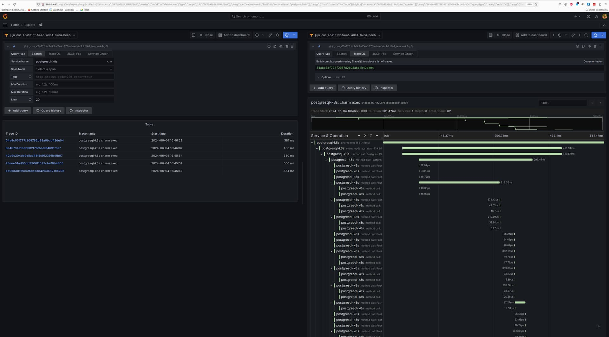

---
myst:
  html_meta:
    description: "Enable distributed tracing for Charmed PostgreSQL using Grafana Tempo and the Canonical Observability Stack with cross-model integrations."
---

(enable-tracing)=
# Enable tracing
{{vm_k8s}}

This guide contains the steps to enable tracing with [Grafana Tempo](https://grafana.com/docs/tempo/latest/) for your PostgreSQL application.

## Prerequisites

* Fully configured monitoring with COS
  * See {ref}`enable-monitoring`

## Deploy Tempo

First, switch to the Kubernetes controller where the COS model is deployed:

```text
juju switch <cos_k8s_controller>:<cos_model>
```

Then, deploy the dependencies of Tempo following this tutorial: [Deploy Tempo HA on top of COS Lite](https://discourse.charmhub.io/t/tutorial-deploy-tempo-ha-on-top-of-cos-lite/15489).

The steps to follow are:

- Deploy the MinIO charm
- Deploy the S3 integrator charm
- Add a bucket into MinIO using a Python script
- Configure S3 integrator with the MinIO credentials

Finally, deploy and integrate with Tempo HA in a monolithic setup, as described in the tutorial.

## Offer interfaces

Next, offer interfaces for cross-model integrations from the model where Charmed PostgreSQL is deployed.

To offer the Tempo integration, run

```shell
juju offer <tempo_coordinator_k8s_application_name>:tracing
```

Then, switch to the Charmed PostgreSQL model, find the offers, and integrate (relate) with them:

```shell
juju switch <postgresql_controller>:<postgresql_model>

juju find-offers <cos_k8s_controller>:
```

{octicon}`alert` Do not miss the "`:`" in the command above.

Below is a sample output where `k8s` is the K8s controller name and `cos` is the model where `cos-lite` and `tempo-k8s` are deployed:

```shell
Store  URL                      Access  Interfaces
k8s    admin/<cos_model>.tempo  admin   tracing:tracing
```

Next, consume this offer so that it is reachable from the current model:

```shell
juju consume <cos_k8s_controller>:admin/<cos_model>.tempo
```

## Consume interfaces

First, deploy [grafana-agent](https://charmhub.io/grafana-agent) / [grafana-agent-k8s](https://charmhub.io/grafana-agent-k8s) from the `1/stable` channel:

````{tab-set}
```{tab-item} VM
:sync: vm

	juju deploy grafana-agent --channel 1/stable
```

```{tab-item} K8s
:sync: k8s

	juju deploy grafana-agent-k8s --channel 1/stable --trust
```
````

Then, integrate Grafana Agent with Charmed PostgreSQL:

````{tab-set}
```{tab-item} VM
:sync: vm

	juju integrate postgresql:cos-agent grafana-agent:cos-agent
```
```{tab-item} K8s
:sync: k8s

	juju integrate grafana-agent-k8s:tracing tempo:tracing
```
````

Finally, integrate Grafana Agent with the consumed interface from the previous section:

````{tab-set}
```{tab-item} VM
:sync: vm

	juju integrate grafana-agent:tracing tempo:tracing
```
```{tab-item} K8s
:sync: k8s

	juju integrate postgresql-k8s:tracing grafana-agent-k8s:tracing-provider
```
````

Wait until the model settles. The following is an example of the `juju status --relations` on the Charmed PostgreSQL model:

````{tab-set}
```{tab-item} VM
:sync: vm

	Model              Controller  Cloud/Region         Version  SLA          Timestamp
	sample-psql-model  lxd         localhost/localhost  3.5.4    unsupported  21:43:34Z

	SAAS        Status  Store       URL
	tempo       active  uk8s        admin/cos.tempo

	App            Version  Status   Scale  Charm          Channel      Rev  Exposed  Message
	grafana-agent           blocked      1  grafana-agent  latest/edge  286  no       Missing ['grafana-cloud-config']|['grafana-dashboards-provider']|['logging-consumer']|['send-remote-write'] for cos-a...
	postgresql     16.9     active       1  postgresql                    0  no

	Unit                Workload  Agent  Machine  Public address  Ports     Message
	postgresql/0*       active    idle   0        10.205.193.87   5432/tcp  Primary
	grafana-agent/0*  blocked   idle            10.205.193.87             Missing ['grafana-cloud-config']|['grafana-dashboards-provider']|['logging-consumer']|['send-remote-write'] for cos-a...

	Machine  State    Address        Inst id        Base          AZ  Message
	0        started  10.205.193.87  juju-1fee5d-0  ubuntu@22.04      Running

	Integration provider       Requirer                   Interface              Type         Message
	grafana-agent:peers        grafana-agent:peers        grafana_agent_replica  peer
	postgresql:cos-agent       grafana-agent:cos-agent    cos_agent              subordinate
	postgresql:database-peers  postgresql:database-peers  postgresql_peers       peer
	postgresql:restart         postgresql:restart         rolling_op             peer
	postgresql:upgrade         postgresql:upgrade         upgrade                peer
	tempo:tracing              grafana-agent:tracing      tracing                regular
```
```{tab-item} K8s
:sync: k8s

	Model              Controller   Cloud/Region        Version  SLA          Timestamp
	sample-psql-model  k8s          microk8s/localhost  3.5.4    unsupported  16:52:21Z

	SAAS   Status  Store       URL
	tempo  active  k8s         admin/cos.tempo

	App                Version  Status  Scale  Charm              Channel      Rev  Address         Exposed  Message
	grafana-agent-k8s  0.40.4   active      1  grafana-agent-k8s  latest/edge   93  10.152.183.226  no       grafana-dashboards-provider: off, logging-consumer: off, send-remote-write: off
	postgresql-k8s     16.9     active      1  postgresql-k8s                    0  10.152.183.96   no

	Unit                  Workload  Agent  Address       Ports  Message
	grafana-agent-k8s/0*  active    idle   10.1.241.195         grafana-dashboards-provider: off, logging-consumer: off, send-remote-write: off
	postgresql-k8s/0*     active    idle   10.1.241.197         Primary

	Integration provider                Requirer                       Interface              Type     Message
	grafana-agent-k8s:peers             grafana-agent-k8s:peers        grafana_agent_replica  peer
	grafana-agent-k8s:tracing-provider  postgresql-k8s:tracing         tracing                regular
	postgresql-k8s:database-peers       postgresql-k8s:database-peers  postgresql_peers       peer
	postgresql-k8s:restart              postgresql-k8s:restart         rolling_op             peer
	postgresql-k8s:upgrade              postgresql-k8s:upgrade         upgrade                peer
	tempo:tracing                       grafana-agent-k8s:tracing      tracing                regular
```
````

```{dropdown} All traces are exported to Tempo using HTTP.
:class-container: dropdown-note
:icon: info
:class-title: sd-font-weight-normal

Support for sending traces via HTTPS is an upcoming feature.
```

## View traces

After this is complete, the Tempo traces will be accessible from Grafana under the `Explore` section with `tempo-k8s` as the data source. You will be able to select `postgresql` as the `Service Name` under the `Search` tab to view traces belonging to Charmed PostgreSQL.

Below is a screenshot demonstrating a Charmed PostgreSQL trace:



Feel free to read through the [Tempo HA documentation](https://discourse.charmhub.io/t/charmed-tempo-ha/15531) at your leisure to explore its deployment and its integrations.

